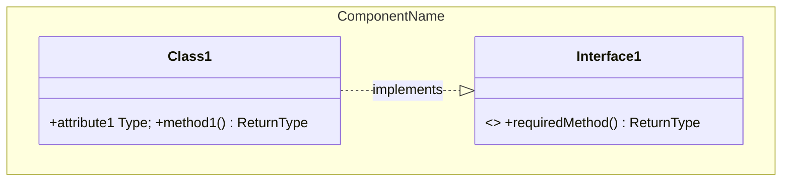
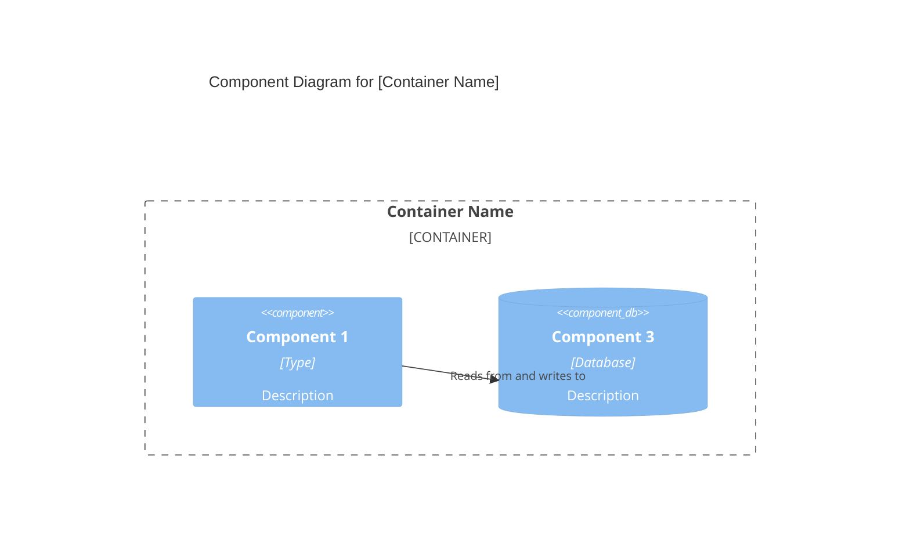
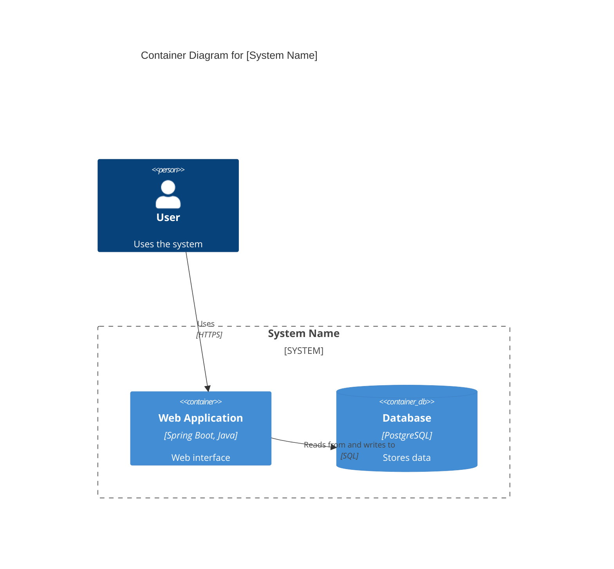
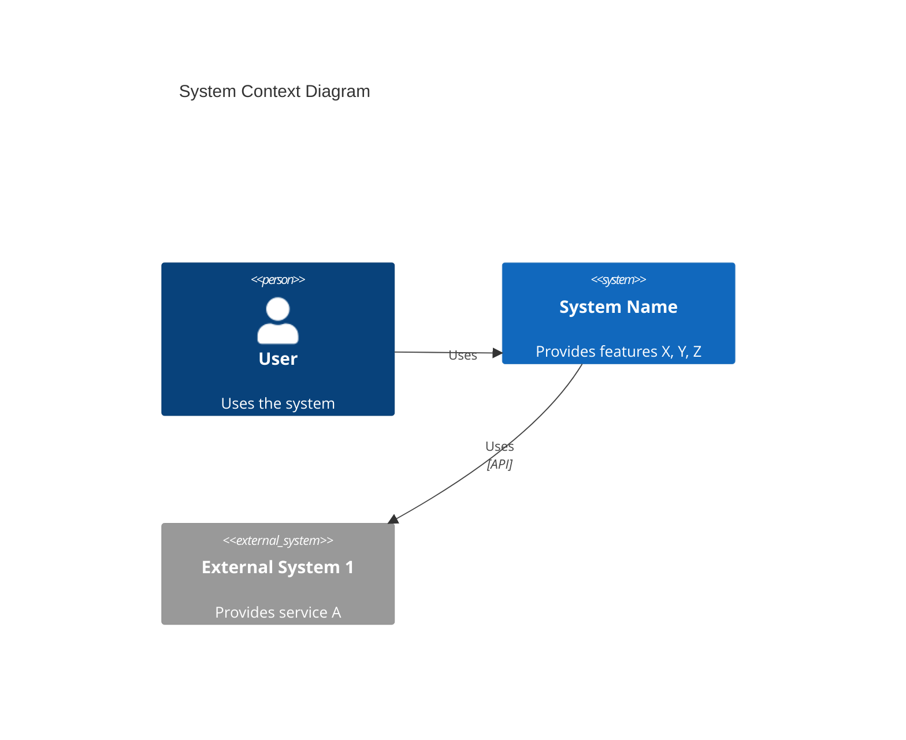

# C4 Architecture Documentation

Sources: `c4-architecture-c4-architecture`, `c4-code`, `c4-component`, `c4-container`,
`c4-context`, `docs-architect`. Use to generate C4 documentation for an existing repository or
long-form technical documentation from a codebase.

## 1. Approach

Bottom-up, starting from the deepest code directories and working upward. Four levels:

1. **Code** — analyze every subdirectory (functions/methods with signatures, classes, internal +
   external dependencies).
2. **Component** — synthesize code docs into logical components within containers.
3. **Container** — map components to deployment containers; document APIs (OpenAPI specs).
4. **Context** — high-level system context with personas, user journeys, external systems.

Note: most teams only need **system context + container** diagrams. Generate all levels for
completeness; teams choose which to keep. Write output to `C4-Documentation/` in repo root.

## 2. Phase 1 — Code level

- Discover all subdirectories; sort deepest-first; filter out `node_modules`, `.git`, `build`,
  `dist`.
- For each directory, document: overview (name/description/location/language/purpose); code
  elements (functions with full signatures, classes/modules with methods); dependencies (internal
  + external); optional Mermaid relationships diagram.
- Save as `c4-code-<dir>.md` (sanitized dir name).

**Diagram choice by paradigm:**

| Code style | Diagram |
|---|---|
| OOP (classes, interfaces) | `classDiagram` (shows inheritance/composition) |
| FP (pure functions, pipelines) | `flowchart` (data transformations) |
| FP (modules with exports) | `classDiagram` with `<<module>>` |
| Procedural (structs + functions) | `classDiagram` |



## 3. Phase 2 — Component level

- Identify component boundaries by domain (related business functionality), technical (shared
  frameworks), or organizational (team ownership).
- Per component: overview (name/type/technology); purpose; software features; contained
  code-elements; interfaces (name, protocol REST/GraphQL/gRPC/Events, operations); dependencies;
  component diagram.
- Create a master component index (`c4-component.md`) with all components + relationship diagram.



## 4. Phase 3 — Container level

- Review component docs + deployment definitions (Dockerfiles, K8s manifests, compose, Terraform,
  cloud service defs, CI/CD).
- Per container: name, description, type (web app/API/DB/queue), technology, deployment;
  purpose; components deployed; interfaces; **OpenAPI spec per container API**
  (`C4-Documentation/apis/<container>-api.yaml`); dependencies + protocols; infrastructure
  (deployment config link, scaling, resources); container diagram.



OpenAPI template (per container):

```yaml
openapi: 3.1.0
info: { title: "[Container Name] API", version: 1.0.0 }
paths:
  /api/resource:
    get:
      summary: [Operation summary]
      responses:
        '200': { description: [Response description] }
```

## 5. Phase 4 — Context level

- Analyze README, architecture/requirements/design docs, tests, API docs, user docs.
- Document: short + long system description; personas (human + programmatic/external system) with
  goals + features used; system features; user journeys (step-by-step with touchpoints) +
  integration journeys; external systems (type, description, integration type, purpose); context
  diagram; links to container/component docs.



Key: focus on people + software systems, NOT technologies/protocols; keep stakeholder-friendly.

## 6. Output structure

```
C4-Documentation/
├── c4-code-*.md            # one per directory
├── c4-component-*.md       # one per component
├── c4-component.md         # master component index + diagram
├── c4-container.md         # containers + APIs
├── c4-context.md           # personas, journeys, external systems
└── apis/<container>-api.yaml
```

Coordination: bottom-up processing; each level builds on the previous; complete coverage (every
directory documented before synthesis); link consistency; Mermaid in proper C4 notation.

## 7. Long-form technical documentation (`docs-architect`)

Process: **Discovery** (analyze codebase structure/dependencies; identify key components; extract
patterns + decisions; map data flows) → **Structuring** (logical chapter hierarchy; progressive
disclosure; plan diagrams; consistent terminology) → **Writing** (executive summary first, then
high-level → implementation detail; include rationale + code examples).

Sections: Executive Summary; Architecture Overview; Design Decisions; Core Components; Data
Models; Integration Points; Deployment Architecture; Performance Characteristics; Security Model;
Appendices (glossary, references).

Best practices: explain the "why"; use concrete codebase examples; create mental models; document
current state + evolutionary history; include troubleshooting and pitfalls; provide reading paths
per audience (developers/architects/ops). Use Markdown with clear heading hierarchy, tables,
blockquotes, and `file_path:line_number` references.