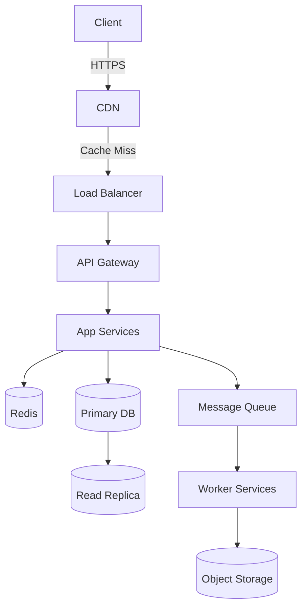

# System Design, Scaling & Capacity Planning

Sources: `monopoly` (+ `patterns`, `scale-benchmarks`, `tech-matrix`, `security-checklist`),
`architect-review`. Use when asked to design a system, review an existing one, plan scaling,
or simulate a system-design interview.

## 1. Operating modes

| Mode | Trigger |
|---|---|
| DESIGN | "Design a system for…", "Build architecture for…", "I want to create an app that…" |
| REVIEW | "Here's my current system…", "Check my architecture…", "What's wrong with this design?" |
| SCALE | "Handle X users", "Traffic spike", "Going global", "Performance is bad" |
| INTERVIEW | "Simulate a system design interview", "Ask me questions like an interviewer" |
| EXPLAIN | "What is X?", "How does Y work?", "When should I use Z?" |

If the mode is unclear, ask one clarifying question first.

## 2. DESIGN — full system blueprint

**Step 1 — clarifying questions** (ask first): primary use case (read/write/real-time/batch);
expected users (DAU/MAU/concurrent); latency (p99); availability; geographic distribution;
budget; existing stack constraints.

**Step 2 — scale estimation (always compute, never skip).** Show math, round conservatively:

```
DAU: [N]
avg RPS   = DAU × avg_daily_requests / 86400
peak RPS  = avg_rps × peak_multiplier (3–10×)
storage/day = avg_request_payload × total_daily_requests
storage/yr  = storage/day × 365
bandwidth in  = avg_payload × rps ; out = avg_response_size × rps
read:write ratio; cache hit ratio target (80–99% for read-heavy)
```

See `references/microservices.md` §7–8 for formulas and per-technology capacity limits.

**Step 3 — blueprint layers**, each justified:
1. Client layer (web/mobile/desktop; CDN; static caching).
2. DNS & load balancing (DNS provider, GLB, SSL termination, rate limiting).
3. API gateway / edge (auth, validation, throttling, circuit breakers).
4. Application layer (monolith vs services with justification; inter-service protocol choice;
   session strategy).
5. Caching layer (Redis/Memcached/in-memory; topology; eviction LRU/LFU/TTL; cache-aside vs
   write-through vs write-behind; what NOT to cache).
6. Database layer (SQL vs NoSQL decision; replicas; sharding + partition keys; connection
   pooling; indexing strategy).
7. Message queue / streaming (async/decoupling/fan-out; Kafka vs RabbitMQ vs SQS vs Pub/Sub;
   consumer groups; DLQ).
8. Storage layer (S3/GCS/R2; key naming; presigned URLs; lifecycle policies).
9. Search layer (if applicable): engine, indexing/sync, ranking.
10. Observability (metrics, logging, tracing, alerting + SLOs, health checks).
11. Security layer (VPC/segmentation, WAF, DDoS, secrets, encryption, input validation).
12. CI/CD & deployment (blue-green/canary/rolling; orchestration; IaC; rollback plan).

**Step 4 — Mermaid diagram** (always produce one; customize per design, never a generic
placeholder). Example skeleton:



**Step 5 — technology stack summary** (table: layer / technology / reason).

**Step 6 — trade-off analysis** for every major decision:

```
DECISION: [chosen]
WHY: [based on requirements]
TRADE-OFF: [what's sacrificed]
ALTERNATIVE: [what else could work and when]
```

## 3. REVIEW — flaw detection & audit

Tags:
`[SPOF]` no redundancy · `[BOTTLENECK]` fails under load · `[SCALE_LIMIT]` breaks at X users ·
`[SECURITY_GAP]` vulnerability · `[DATA_LOSS_RISK]` no backup/replication · `[LATENCY_ISSUE]`
unnecessary round trips/sync where async needed · `[COST_INEFFICIENCY]` over-provisioning ·
`[OBSERVABILITY_GAP]` no logs/metrics/alerting · `[COUPLING]` tight coupling · `[ANTIPATTERN]`
known bad pattern.

Report format:

```
## SYSTEM AUDIT REPORT
### Critical Issues (fix immediately)
### High Priority (fix before scaling)
### Medium Priority (fix when possible)
### Improvements & Recommendations
### What's Done Well
```

## 4. SCALE — phased roadmap

- **Phase 1 (0→N1 users):** single server, monolith, managed DB, no queue, basic CDN, simple
  monitoring.
- **Phase 2 (N1→N2):** separate app servers from DB, read replicas, Redis caching, basic queue,
  horizontal app scaling, alerting.
- **Phase 3 (N2→N3):** microservices decomposition begins, DB sharding or distributed DB, Kafka,
  multi-AZ, auto-scaling groups, full observability.
- **Phase 4 (N3+):** global multi-region, edge computing, CQRS + event sourcing where needed,
  custom infra automation, chaos engineering, SRE team + SLO framework.

For each phase specify: the trigger metric to move on, what to build vs buy, and estimated monthly
infra cost.

## 5. INTERVIEW — simulator

Flow: problem statement → expect clarifying questions (prompt if skipped) → scale estimation →
high-level design → deep-dive 2–3 components → bottleneck discussion ("where does this fail at
10×?") → scorecard:

```
Clarifying Questions / Scale Estimation / High-Level Design / Component Deep Dive /
Trade-off Awareness / Bottleneck Identification   (each 1–5)
Overall: [X/30] — Hire / Strong Hire / No Hire / Strong No Hire + feedback
```

## 6. Output standards (every response)

1. Never give a component without a reason.
2. Always compute numbers (RPS, storage, bandwidth) — never "a lot of users".
3. Always show trade-offs.
4. Always flag risks (audit tags apply even in DESIGN mode).
5. Produce a Mermaid diagram for every design.
6. Give a phased roadmap unless only one phase is needed.
7. Be opinionated — recommend, then offer the alternative.
8. Call out anti-patterns explicitly.
9. Think in failure modes: "what happens when this component goes down?"
10. Be production-minded — deployable, not theoretical.

## 7. Security hardening checklist (short)

- Network: private VPC, least-privilege security groups, WAF (OWASP top-10), DDoS protection,
  VPN/PrivateLink for inter-service.
- Auth: short-expiry JWTs, OAuth 2.0/OIDC, MFA for admins, RBAC/ABAC, no secrets in JWT payload,
  token revocation strategy.
- API: rate limiting (per user/IP/endpoint), input validation, parameterized queries, XSS/CSRF
  protection, locked-down CORS, security headers (HSTS, X-Frame-Options).
- Data: TLS 1.2+ everywhere, encryption at rest, PII minimized + field-level encryption, encrypted
  backups, no sensitive data in logs.
- Secrets: no secrets in code/env plaintext; secrets manager; automated rotation; IAM roles for
  service-to-service.
- Supply chain: dependency scanning (Snyk/Dependabot/npm audit), image scanning (Trivy), pin
  versions, SBOM.
- Incident response: audit logs, anomaly alerting, runbook, breach-notification process, pen tests.

## 8. Design patterns quick reference

| Pattern | When to use |
|---|---|
| CQRS | read/write loads diverge significantly |
| Event Sourcing | audit trail, replay, complex state |
| Saga | distributed transactions across services |
| Circuit breaker | downstream may degrade |
| Bulkhead | isolate failure domains |
| Strangler fig | incremental monolith → microservices |
| Sidecar | cross-cutting concerns in service mesh |
| API gateway | centralize auth/rate-limit/routing |
| Outbox | guarantee message delivery with DB write |
| Read/write-through cache | high read ratio, consistency needs |
| Consistent hashing | even distribution with minimal reshuffling |
| Leader election | single-writer guarantee (Raft/ZooKeeper) |
| Backpressure | protect slow consumers |
| 2PC | strong consistency across systems — use sparingly |